### Вступление: хостинг

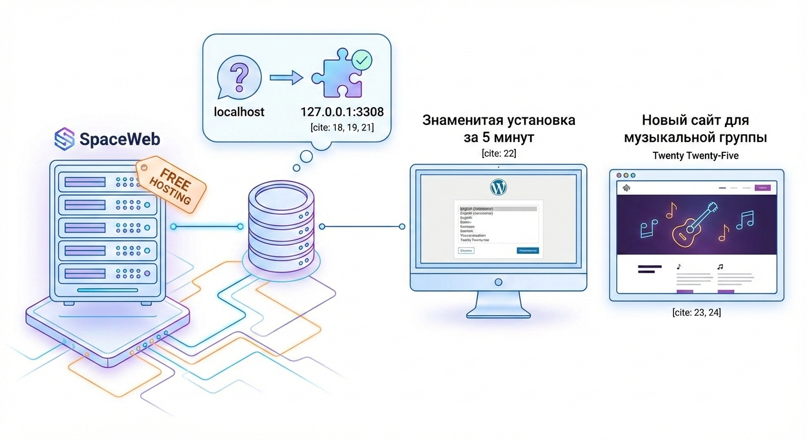

Прежде чем начать разработку сайта, нам необходимо подготовить для него хостинг.

> **Справка**
>
> **Хостинг** — это услуга размещения сайта на сервере, который постоянно подключён к интернету.
>
>Когда вы создаёте сайт, его файлы (тексты, изображения, код, база данных) нужно где-то хранить. Хостинг — это аренда места на сервере, чтобы сайт был доступен пользователям 24/7 по доменному имени.
>
>Основные виды хостинга:
>
>- **Локальный хостинг** — размещение сайта на своём компьютере.
>- **Виртуальный** — несколько сайтов на одном сервере.
>- **VPS/VDS** — выделенная часть сервера с отдельными ресурсами.
>- **Выделенный сервер** — отдельный физический сервер.
>- **Облачный хостинг** — ресурсы распределены между несколькими серверами.
>
>Без хостинга сайт не будет доступен в интернете.

Для этапа разработки, я выбрал бесплатный хостинг. Проще всего было зарегистрировать его на [spaceweb](https://sweb.ru/hosting/free/):

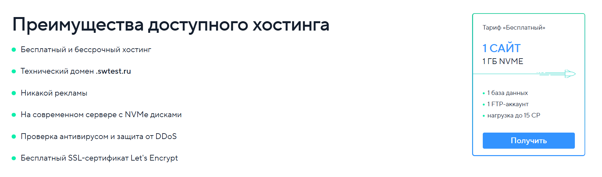
Хоть хостинг и бесплатный, на нём есть всё, для того чтобы запустить полноценный сайт:

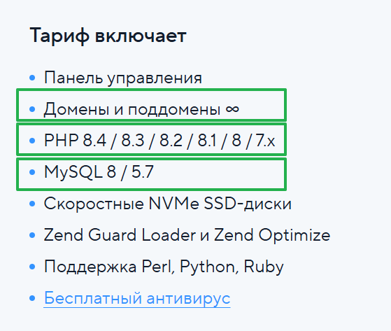

Для Wordpress все условия подходят, нам нужен PHP последних версий и MySQL. 

А для того, чтобы в дальнейшем, после окончания разработки, первое время, пока на сайт не будет иметь большой нагрузки, нам пригодится и возможность привязывать к сайту свой домен.

Тут мы сможем сделать абсолютно полноценный сайт.

**Примечание**
У spaceweb указано, что это бессрочный хостинг, но на самом деле ваш сайт могут удалить, если он несколько месяцев будет превышать лимит нагрузки, и вы не переведёте его на платный тариф.

Я нажал кнопку "Получить":

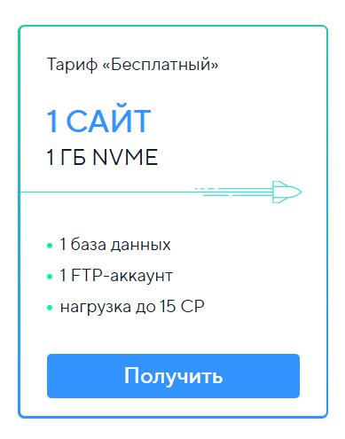
Ввёл свой телефонный номер:

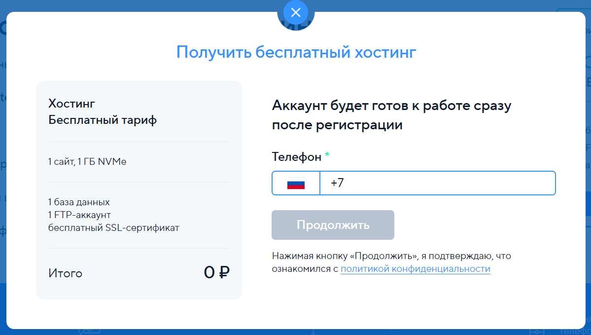

После подтверждения SMS-кодом, я указал адрес своей электронной почты, на который мне пришли все данные от хостинга:

**Данные для входа в панель управления, FTP- и SSH-доступа**

Адрес панели: [cp.sweb.ru](http://cp.sweb.ru/)
Логин: `login`
IP-адрес сервера: `77.222.40.198`
Пароль: `password`

С помощью полученных данных, я перешёл на админ-панель, вошёл в аккаунт, и запустил автоматическую установку Wordpress:

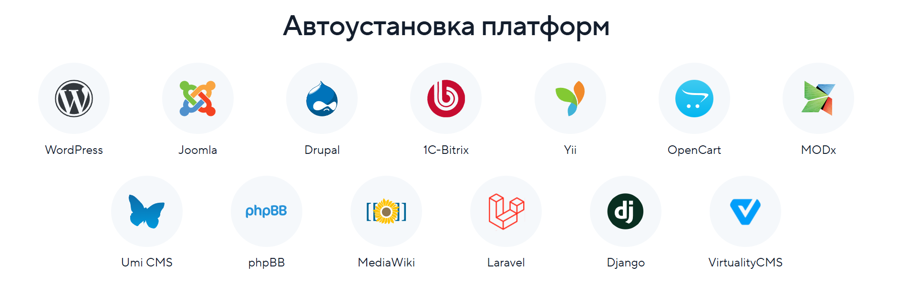

После чего, в разделе Хостинг -> Сайты, появился наш готовящийся сайт:

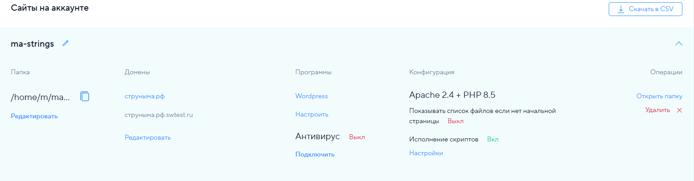

В секции Домены, указано 2 домена, но на самом деле домен `струныма.рф` ещё н привязан к сайту. Его я указал, т.к. в дальнейшем, после окончания разработки он будет использоваться на этом сайте. И для этого нам нужно будет провести ещё некоторые настройки, о которых я расскажу в соответствующей главе.

Также у нас появился технический домен `струныма.рф.swtest.ru` по которому сайт уже доступен.

Перейдя по нему, открылось окно настройки Wordpress:

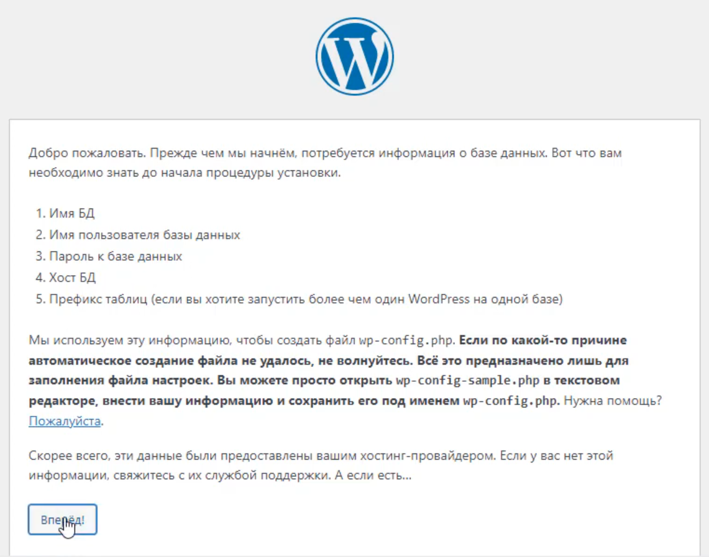

В котором нам нужно заполнить данные с хостинга:

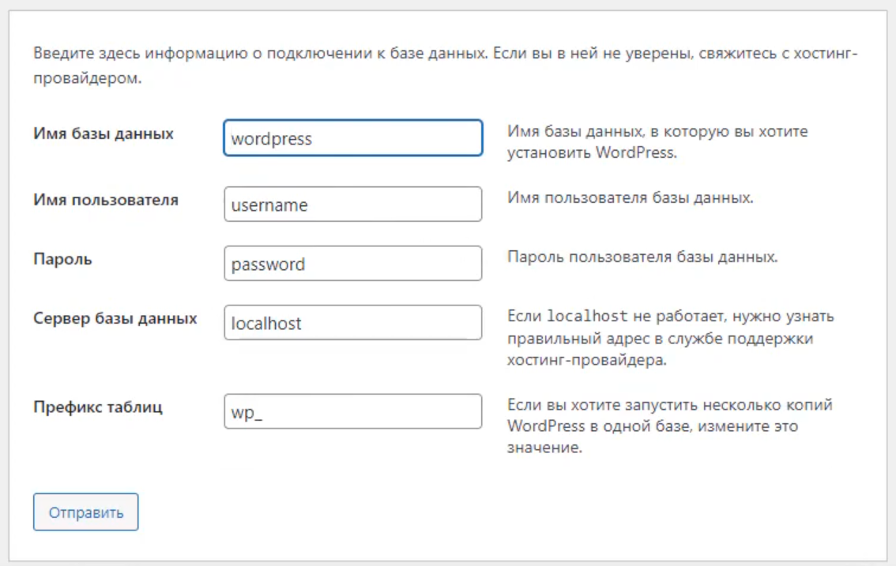

Эти данные находятся в панели управления хостингом во кладке База данных:

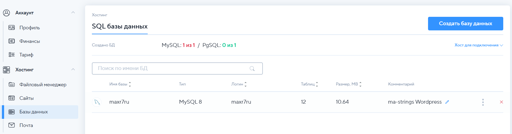

Здесь мы видим имя базы и логин, которые соответствуют полям в форме, которую Wordress просит нас заполнить:

- Имя базы данных = Имя базы
- Имя пользователя = Логин

Пароль можно найти в почтовом сообщении со всеми данными, либо же если он не был прислан, то тут же изменить его:

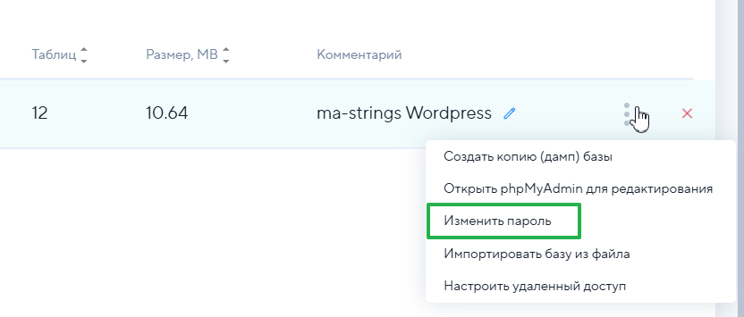

Префикс таблиц, нам не нужно изменять, с этим полем всё в порядке.

Таким образом получается, что у нас теперь заполнены все поля, кроме:

**Сервер базы данных**

И с этим полем мне пришлось повозиться. 

Обычно по умолчанию оно указывается как `localhost`, т.е. локальный адрес сервера. Но на этом хостинге, такой адрес не срабатывал. Wordpress выводил ошибку подключения.

Я вернулся в админ-панель, перешёл в настройку доступа:

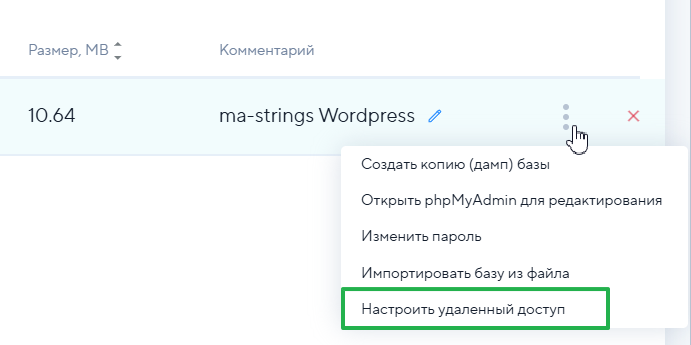

И там увидел, что `localhost` есть в разрешённых доступах:

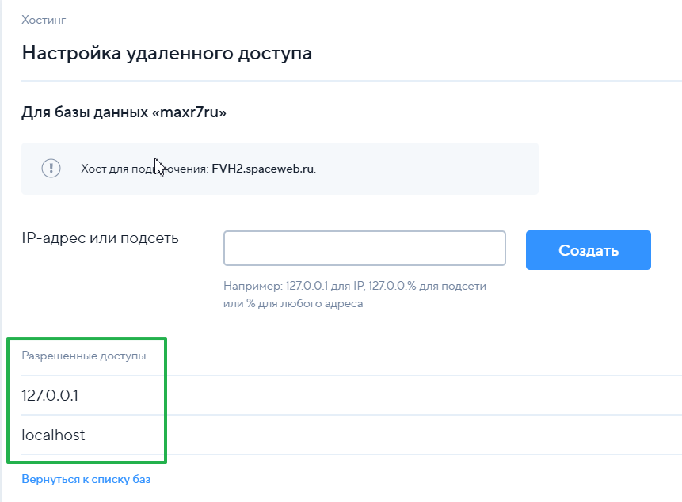

Странно, но Wordpress так и не мог подключиться к базе данных по этому адресу.

Я попробовал `127.0.0.1`, что на самом деле то же самое, что и `localhost`, только в обычном IP-формате, но это также не помогло.

Обычно если пользователь сталкивается с какими-то проблемами, то он обращается в службу поддержки, но на бесплатных тарифах, поддержка не оказывается:

Я продолжил искать решение, и всё в том же разделе "Базы данных", я заметил надпись "Хост для подключения":

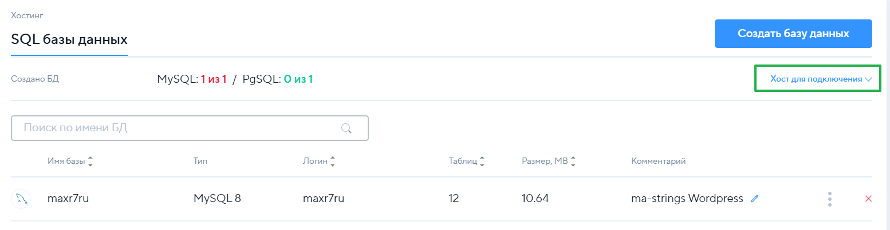

Вот здесь то и красовался нужный нам адрес:

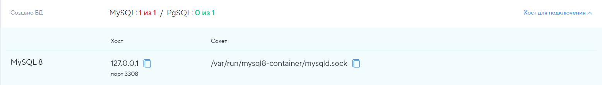

Оказалось, что для подключения необходимо также указать и порт.

Для поля "Сервер базы данных" у нас получилась такая запись:

`127.0.0.1:3308`

Введя заветные цифры, Wordpress обрадовался и пропустил нас дальше:

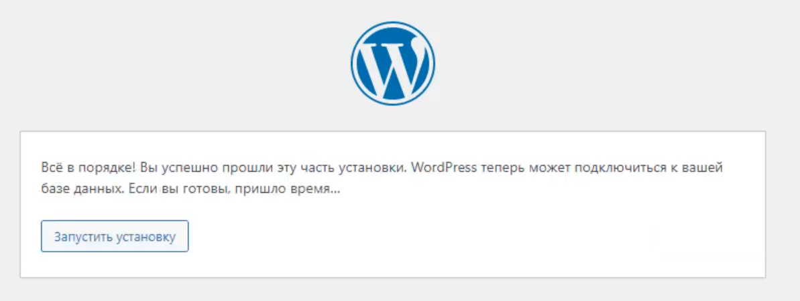

После чего запустился стандартный процесс установки, в котором я указал логин и пароль к будущему аккаунту администратора, а также остальные данные, которые заполняются при обычных регистрациях аккаунтов.

После чего, меня встретила главная страница стандартной темы Twenty Twenty-Five:

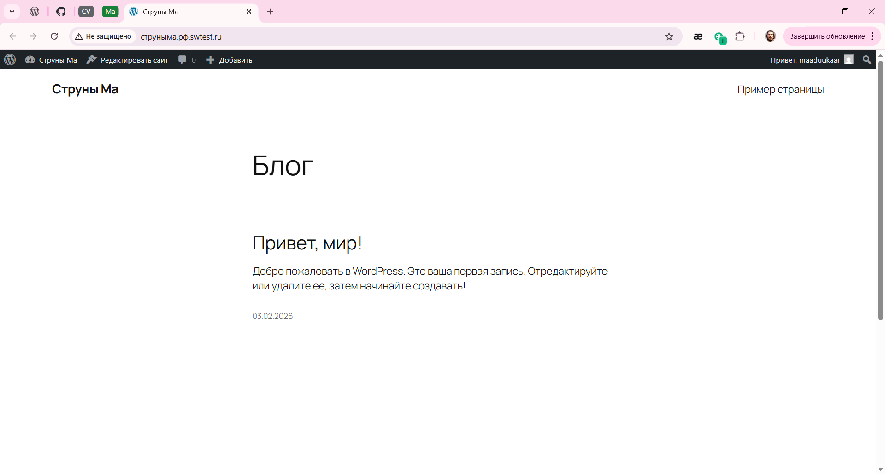

Так начался процесс разработки нового сайта, для славной музыкальной группы.

### Техническое задание

**Глава 1: Divi**